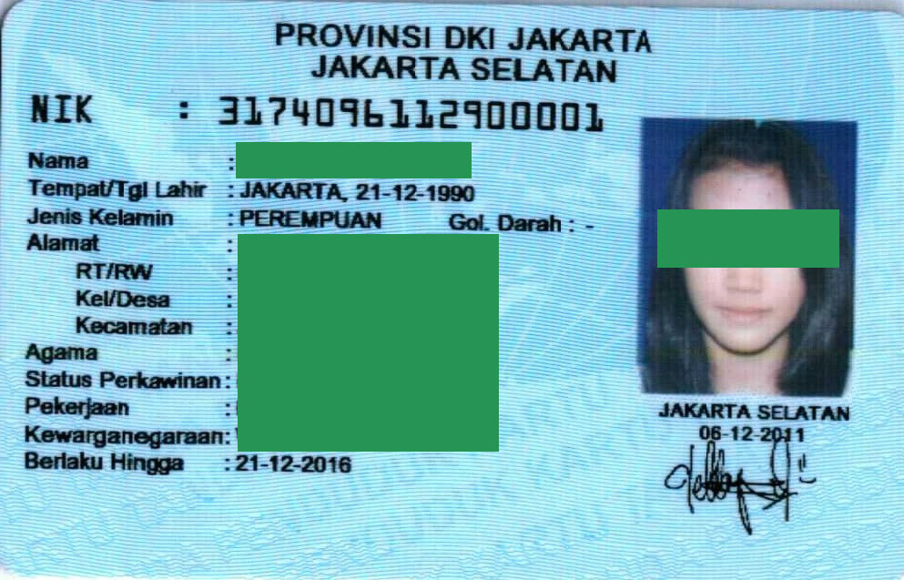
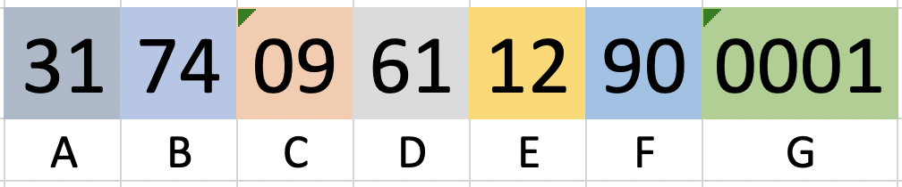

# Skema eKTP

| # | keterangan |
|---|---|---|
| A | Propinsi) |
| B | Kota/Kabupaten |
| C | Kecamatan |
| D | Tanggal lahir, jika wanita ditambah 40 |
| E | Bulan lahir |
| F | Tahun lahir |
| G | Urutan terdaftar pada Disdukcapil untuk yang tanggal lahirnya sama|
| JK | Wanita, tanggal lahir diatas angka 40, jika Pria tanggal lahir tetap |
| Jumlah | 16 digit |

## Contoh

| # | keterangan |
|---|---|---|
| 31 | DKI JAKARTA |
| 74 | KOTA JAKARTA BARAT |
| 09 | JAGAKARSA |
| 61 | Tanggal lahir, jika wanita dikurangi 40, 61-40 = **21** |
| 12 | Bulan 12, Desember |
| 90 | Tahun 1990 |
| 0001 | Pendaftar pertama di Disdukcapil untuk tanggal lahir tersebut |
| JK | Wanita Dikarenakan tanggal lahir diatas angka 40 |

Bila mana hasil perhitungan berbeda, maka bisa jadi eKTP palsu atau pihak Disdukcapil tidak teliti

## eKTP Palsu?

| # | keterangan |
|---|---|---|
| 36 | BANTEN |
| 01 | KAB. PANDEGLANG |
| 18 | CIMANUK |
| 50 | Tanggal lahir, jika wanita dikurangi 40, 50-40 = **10** |
| 09 | Bulan 9, September |
| 86 | Tahun 1986 |
| 0001 | Pendaftar pertama di Disdukcapil untuk tanggal lahir tersebut|
| JK | Wanita, Dikarenakan tanggal lahir diatas angka 40 |

Tetapi jika dilihat di eKTP, tertulis tanggal 17-10-1986, 17 Oktober 1986, sedangkan di nomor eKTP berbeda.

Ada juga yang Wanita tapi tanggal lahir dibawah angka 40, atau yang Pria, tapi tanggal lahir diatas 40.

## Validasi

Dengan skema diatas, maka kita dapat memvalidasi apakah eKTP itu benar, sebagai tahap awal verifikasi. pastikan Jumlah karakter 16 digit, tanggal lahir sama, dan jenis kelamin sama

## Singkatan
| Singkatan | keterangan |
|---|---|---|
| JK | Jenis Kelamin |
| KAB | KABUPATEN |